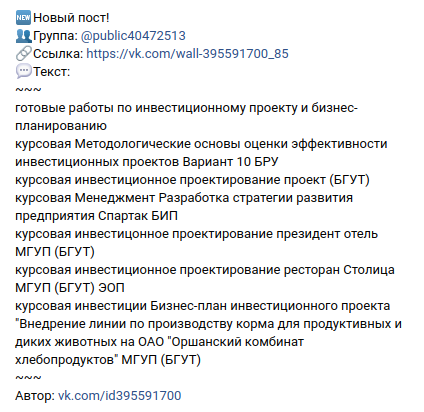
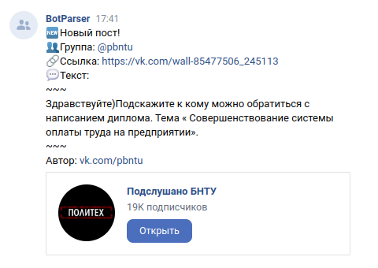

# Bot Parser для Вконтакте
---
Бот, созданный для парсинга фильтрованных записей из определённых групп.
Передаётся информация в формате:

```
🆕Новый пост!
👥Группа: @public
🔗Ссылка: https://vk.com/wall-
💬Текст:
~~~
'text'
~~~
Автор: vk.com/id
```

Автором поста может являться как человек:



Так и сообщество:



Реализованы функции изменения списка ключевых слов, с помощью которых фильтруются записи, а также групп, которые бот обрабатывает. Количество запросов в секунду ограничено для сохранения правил пользования API ВКонтакте. 
Настройки бота изменяются с помощью кнопок в диалоге - есть возможности просмотреть, удалить или добавить группы или ключевые слова. Сохранение настроек осуществляется локально - в рабочей директории. Парсинг данных осуществляется один раз, через настраиваемое количество времени.

## config.ini
*config.ini создаётся вручную*

Конфигурационный файл настраивается перед запуском, требует 
1. Токен администратора (токен не группы, а пользователя) с правами `offline_access` и `wall`
2. Токен группы, от имени которой бот будет работать
3. `id` страницы администратора

## Запуск
Для запуска необходимо добавить команду  `python3 path_to_dir/main.py` в cron, с необходимыми настройками времени. При этом бот инициализируется и через определённое количество времени (заданное в коде) начнёт парсинг записей. Из-за ограничений количества запросов в единицу времени парсинг занимает некоторе ощутимое время (в зависимости от настроек - количества групп и обрабатываемых записей), поэтому время перезапуска бота не должно быть меньше времени, необходимого для парсинга.

Логирование осуществляется в папку `/log`, в отдельный файл для каждого модуля и настраивается с помощью конфига в каждом модуле отдельно. Реализован debug-режим.

